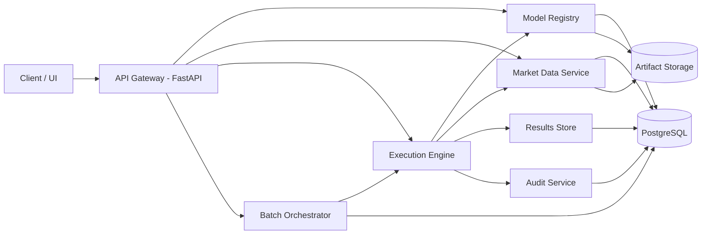
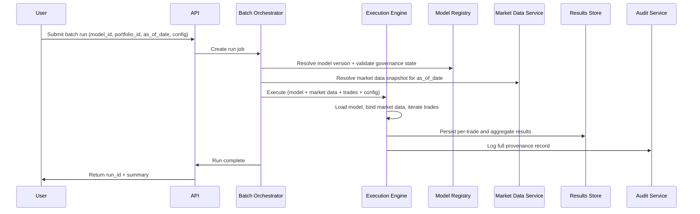

# Risk Model Execution Platform — Design Document

---

## 1. Project Scope

### Objective

Build a **MEX-style Risk Model Execution Platform** that enables quantitative analysts and risk teams to:

- Register, version, and govern risk models through a controlled lifecycle
- Execute models against portfolios of trades using versioned market data
- Run batch risk calculations (end-of-day, ad-hoc stress tests)
- Maintain full provenance — every output traces back to the exact model version, market data snapshot, run configuration, and input positions

This system simulates internal model execution platforms used at banks (e.g., MEX/FRAME at HSBC), where **regulatory auditability and deterministic reproducibility** are non-negotiable.

---

### Goals

- Provide a **controlled execution environment** for risk models
- Support **nightly batch and on-demand risk calculations** across trade portfolios
- Version **everything**: models, market data, run configs, results
- Enable **full run provenance** — any regulatory number traces back to its inputs
- Implement **model governance lifecycle** (development → production → deprecated)

---

### Non-Goals (MVP)

- Model training or development tooling (quants build models externally)
- Real-time streaming / HFT-level latency
- Full ML pipeline (feature stores, experiment tracking)
- Multi-tenant / multi-desk isolation

---

## 2. Domain Context

### What MEX Platforms Do

At banks, quant teams develop risk models (pricing, VaR, stress testing). These models are then **handed off** to a model execution platform that:

1. **Governs** the model through an approval lifecycle before it can produce official numbers
2. **Binds** the model to versioned market data (curves, surfaces, spot rates) at execution time
3. **Runs** the model against a book of trades — typically in nightly batch jobs
4. **Stores** every result with full provenance for regulatory reporting
5. **Reproduces** any past calculation exactly, months or years later

The platform doesn't care _how_ a model was built — it cares that the model runs correctly, deterministically, and traceably.

### Reference Models

This platform will ship with two concrete risk models to demonstrate the execution framework:

**1. Historical VaR (Value at Risk)**
- **Input**: Portfolio of equity positions + historical price data
- **Calculation**: Compute portfolio returns over a lookback window, report the loss at a given confidence level (e.g., 99% 1-day VaR)
- **Output**: VaR estimate, Expected Shortfall (CVaR), P&L distribution summary
- **Why**: VaR is the foundational market risk metric reported to regulators daily

**2. Bond Pricer**
- **Input**: Bond trade details (face value, coupon rate, maturity) + yield curve snapshot
- **Calculation**: Discount future cash flows using the yield curve to compute present value, duration, and convexity
- **Output**: Clean price, dirty price, modified duration, convexity, DV01
- **Why**: Bond pricing from yield curves is core fixed-income risk — it demonstrates market data binding and deterministic repricing

---

## 3. Technical Stack

### Backend

- **Python 3.11+**
- **FastAPI** (REST API)
- **Pydantic** (schema validation)
- **NumPy / Pandas** (calculations)

### Database

- **PostgreSQL** — model metadata, run history, audit logs, results
- **SQLAlchemy** (ORM)
- **Alembic** (migrations)

### Storage

- **Local filesystem** (MVP) — model artifacts, market data files
- **S3-compatible** (future) — production artifact storage

### Async / Batch

- **Celery + Redis** — batch job orchestration, async execution

### Infrastructure

- **Docker + Docker Compose** — local development and deployment
- **GitHub Actions** — CI/CD

### UI (Optional)

- **Streamlit** dashboard — run monitoring, result exploration

---

## 4. Architecture

### High-Level System



### Batch Execution Flow



### Key Principles

- **Everything is versioned**: models, market data, configs, results
- **Provenance by default**: every result links back to its exact inputs
- **Batch-first**: nightly runs across trade books are the primary use case
- **Governance-gated**: only approved models produce official numbers
- **Deterministic reproduction**: re-running with the same inputs produces the same outputs

---

## 5. Component Breakdown

### 5.1 API Layer (FastAPI)

External interface for all platform operations.

**Model Management**
- `POST /models` — register a new model (upload artifact + metadata)
- `GET /models` — list models (filterable by status, type, owner)
- `GET /models/{id}` — model details + version history
- `POST /models/{id}/versions` — upload a new version
- `PATCH /models/{id}/versions/{version}/status` — transition governance state

**Market Data**
- `POST /market-data/snapshots` — upload a market data snapshot
- `GET /market-data/snapshots` — list snapshots (filterable by as-of date, type)
- `GET /market-data/snapshots/{id}` — retrieve snapshot details + data

**Portfolios**
- `POST /portfolios` — create a portfolio (upload trades/positions)
- `GET /portfolios` — list portfolios
- `GET /portfolios/{id}` — retrieve portfolio with positions

**Execution**
- `POST /runs` — submit a run (model + portfolio + as-of date + config)
- `GET /runs` — list runs (filterable by status, model, date)
- `GET /runs/{id}` — run details + status + provenance
- `GET /runs/{id}/results` — retrieve results (per-trade and aggregate)
- `POST /runs/{id}/cancel` — cancel a running job

### 5.2 Model Registry

Manages model artifacts and governance lifecycle.

**Governance States (MVP):**
```
development → production → deprecated
```

- Only models in `production` state can be used for official batch runs
- Models in `development` can be used for ad-hoc/test runs (flagged as unofficial)
- State transitions are logged in the audit trail
- Each version is immutable once uploaded — new changes require a new version

**Extended states (Phase 4, with auth):** `pending_review`, `approved`, `archived` — these require user roles to be meaningful

**Metadata stored:**
- Model name, description, owner
- Model type (e.g., `historical_var`, `bond_pricer`)
- Input/output schema declarations
- Version history with artifact hashes (SHA-256)

### 5.3 Market Data Service

Stores and serves versioned market data snapshots.

**Snapshot types (MVP):**
- `equity_prices` — historical daily closing prices for equity tickers
- `yield_curve` — term structure (tenor → zero rate) for a given as-of date

**Key properties:**
- Snapshots are immutable — once uploaded, they don't change
- Each snapshot has an `as_of_date` (the business date the data represents)
- Snapshots are referenced by ID in execution runs for reproducibility

**As-of-date resolution:**
When a run is submitted with an `as_of_date` instead of a specific `snapshot_id`, the Market Data Service resolves the snapshot:
- MVP: **exact match required** — if no snapshot exists for the requested as-of date and type, the run fails with a clear error. This teaches why data completeness matters in banks (missing market data = no risk numbers = regulatory breach).
- Future: configurable fallback (e.g., use most recent prior business day)

### 5.4 Portfolio / Trade Store

Manages collections of trades that models execute against.

**Trade types (MVP):**
- `equity_position` — ticker, quantity, entry price
- `bond_position` — face value, coupon rate, coupon frequency, maturity date

**Portfolios:**
- A portfolio is a named, versioned collection of trades
- Portfolios are immutable per version — modifications create a new version

### 5.5 Execution Engine

Core computation layer. Loads a model, binds it to market data and trades, runs the calculation.

**Execution contract:**
Every model must implement:
```python
class RiskModel(Protocol):
    def model_info(self) -> ModelInfo: ...
    def validate_inputs(self, market_data: MarketData, trades: list[Trade]) -> ValidationResult: ...
    def execute(self, market_data: MarketData, trades: list[Trade], config: RunConfig) -> RunResult: ...
```

`model_info()` returns:
- Required market data types (e.g., `["equity_prices"]` or `["yield_curve"]`)
- Accepted trade types (e.g., `["equity_position"]` or `["bond_position"]`)
- Config schema (expected parameters and defaults)

This lets the engine fail fast with clear errors ("model requires yield_curve but snapshot is equity_prices") before loading data or running calculations.

**Execution steps:**
1. Resolve and load model artifact from registry
2. Call `model.model_info()` — check compatibility with provided market data type and trade types
3. Validate model governance state (reject if not allowed for official runs)
4. Resolve market data snapshot (by ID or as-of date)
5. Load portfolio trades
6. Call `model.validate_inputs()` — fail fast on data mismatches
7. Call `model.execute()` — run the calculation
8. Persist results to results store
9. Write audit record with full provenance

**Input mismatch handling (MVP):**
The engine fails with descriptive errors for these cases:
- Portfolio contains a ticker not present in the market data snapshot → error listing missing tickers
- Yield curve doesn't cover the tenor needed for a bond's maturity → error with required vs. available range
- Market data has gaps (missing dates in price history) → error with gap details
- Portfolio has zero positions → error, nothing to compute
- Model requires a market data type that doesn't match the provided snapshot → error from `model_info()` check

These fail-fast behaviors reflect real MEX engineering: unclear failures in financial calculations are unacceptable.

**Sandboxing (MVP):**
- Models are Python modules loaded via importlib (not pickle)
- Models must conform to the `RiskModel` protocol
- Future: containerized execution per model

### 5.6 Batch Orchestrator (Celery + Redis)

Manages batch runs — the primary execution mode.

**Job lifecycle:**
```
pending → running → completed | failed | cancelled
```

**Capabilities:**
- Submit a batch run: model + portfolio + as-of date + config
- Poll job status via `GET /runs/{id}`
- Cancel running jobs
- Retry failed jobs with same inputs
- Support concurrent runs across different models/portfolios

### 5.7 Results Store

Persists and serves calculation outputs.

**Stored per run:**
- Per-trade results (e.g., each bond's price, each position's P&L contribution)
- Aggregate results (e.g., portfolio VaR, total DV01)
- Run metadata: duration, trade count, warnings/errors

**Queryable by:**
- Run ID
- Model ID + date range
- Portfolio ID

### 5.8 Audit Service

Every action that affects data or produces outputs is logged.

**Audit record for each run:**
- `run_id`
- `model_id` + `model_version` + artifact SHA-256
- `market_data_snapshot_id`
- `portfolio_id` + `portfolio_version`
- `run_config` (full parameter set)
- `submitted_by` (user)
- `submitted_at` / `completed_at`
- `status` + error details if failed

**Also logs:**
- Model governance state transitions (who approved, when)
- Market data snapshot uploads
- Portfolio modifications

This is the chain that lets a regulator ask "where did this VaR number come from?" and get a complete answer.

---

## 6. Reference Model Specifications

### 6.1 Historical VaR

**Purpose:** Estimate the worst expected loss on a portfolio over a given holding period at a given confidence level, using historical price data.

**Inputs:**
- Portfolio of equity positions (ticker, quantity)
- Equity price history snapshot (daily closes, N days)
- Config: confidence level (default 0.99), holding period (default 1 day), lookback window (default 252 days)

**Calculation:**
1. Compute daily log returns for each asset: `r_i = ln(P_i,t / P_i,t-1)`
2. Compute position weights: `w_i = (quantity_i × latest_price_i) / portfolio_value`
3. Compute portfolio daily returns: `r_p,t = Σ w_i × r_i,t`
4. Sort portfolio returns ascending
5. VaR = negative of the return at the `(1 - confidence)` percentile, scaled by portfolio value
6. For multi-day holding periods, scale using square-root-of-time: `VaR_N = VaR_1 × √N`
7. Expected Shortfall (CVaR) = mean of all returns worse than (below) the VaR threshold, scaled by portfolio value

**Outputs:**
- `var_absolute` — dollar VaR
- `var_relative` — VaR as percentage of portfolio value
- `expected_shortfall` — CVaR (dollar)
- `portfolio_value` — current mark-to-market
- `return_statistics` — mean, std, skew, kurtosis of portfolio returns

**Known simplifications (MVP):**
- Equal-weighted historical returns (real banks often use EWMA — exponentially weighted moving average — to give more weight to recent observations)
- Square-root-of-time scaling for multi-day VaR (assumes i.i.d. returns, which doesn't hold in practice — real systems use overlapping multi-day returns or simulation)
- Component VaR (per-position contribution) is deferred to a future phase — it requires the covariance matrix approach or perturbation method
- No business day calendar — all calendar days in the data are used as-is

### 6.2 Bond Pricer

**Purpose:** Price a portfolio of fixed-rate bonds using a yield curve, computing price sensitivities.

**Inputs:**
- Portfolio of bond positions (face value, coupon rate, coupon frequency, maturity date)
- Yield curve snapshot (tenor → zero rate, e.g., 0.25Y → 4.5%, 1Y → 4.2%, ...)
- Config: valuation date, day count convention (default ACT/365)

**Calculation:**
1. Generate cash flow schedule for each bond (coupon dates + principal repayment at maturity)
2. Interpolate yield curve to get zero rates for each cash flow date — **linear interpolation on zero rates** for MVP
3. Compute year fractions for each cash flow date using the day count convention
4. Present value = sum of discounted cash flows: `PV = Σ CF_i / (1 + r_i)^t_i`
5. Accrued interest = `coupon_payment × (days_since_last_coupon / days_in_coupon_period)`
6. Clean price = PV (per unit of face value); Dirty price = clean price + accrued interest
7. Macaulay duration = `(1/PV) × Σ (t_i × CF_i / (1 + r_i)^t_i)`
8. Modified duration = `Macaulay duration / (1 + r/frequency)` where r is the bond's yield
9. Convexity = `(1/PV) × Σ (t_i × (t_i + 1) × CF_i / (1 + r_i)^(t_i + 2))`
10. DV01 = modified duration × PV × 0.0001

**Outputs per bond:**
- `clean_price`, `dirty_price`
- `accrued_interest`
- `modified_duration`, `macaulay_duration`
- `convexity`
- `dv01` — dollar value of a basis point

**Portfolio-level aggregates:**
- Total market value
- Portfolio-weighted duration and convexity
- Total DV01

**Known simplifications (MVP):**
- Linear interpolation on zero rates (real systems use cubic spline or log-linear on discount factors — different methods produce different prices)
- ACT/365 day count convention only (bonds commonly use 30/360 for US corporates or ACT/ACT for US Treasuries)
- No business day calendar — coupon dates that fall on weekends/holidays are not adjusted (real systems use modified following or preceding conventions)
- Yield curve extrapolation is not supported — if a bond's maturity exceeds the curve's longest tenor, the engine returns an error

---

## 7. Data Models

### Core Entities (PostgreSQL)

```
models
├── id (UUID)
├── name
├── description
├── model_type (historical_var | bond_pricer | custom)
├── owner
├── created_at
└── updated_at

model_versions
├── id (UUID)
├── model_id (FK → models)
├── version_number (sequential)
├── governance_status (development | production | deprecated)
├── artifact_path
├── artifact_hash (SHA-256)
├── input_schema (JSON)
├── output_schema (JSON)
├── created_at
└── status_changed_at

market_data_snapshots
├── id (UUID)
├── snapshot_type (equity_prices | yield_curve)
├── as_of_date
├── description
├── data_path
├── data_hash (SHA-256)
├── created_at
└── metadata (JSON — tickers included, curve tenors, etc.)

portfolios
├── id (UUID)
├── name
├── version_number
├── created_at
└── description

portfolio_positions
├── id (UUID)
├── portfolio_id (FK → portfolios)
├── trade_type (equity_position | bond_position)
├── instrument_data (JSON — ticker/quantity or face_value/coupon/maturity/etc.)
└── created_at

runs
├── id (UUID)
├── model_version_id (FK → model_versions)
├── market_data_snapshot_id (FK → market_data_snapshots)
├── portfolio_id (FK → portfolios)
├── as_of_date (the business date this run represents)
├── run_config (JSON — confidence level, holding period, etc.)
├── status (pending | running | completed | failed | cancelled)
├── is_official (boolean — true only if model is in production state)
├── submitted_by
├── submitted_at
├── started_at
├── completed_at
├── error_detail (nullable)
└── summary (JSON — high-level results)

run_results
├── id (UUID)
├── run_id (FK → runs)
├── result_type (per_trade | aggregate)
├── position_id (FK → portfolio_positions, nullable)
├── result_data (JSON)
└── created_at

audit_log
├── id (UUID)
├── event_type (model_registered | version_uploaded | status_changed | run_submitted | run_completed | snapshot_uploaded | ...)
├── entity_type (model | model_version | run | snapshot | portfolio)
├── entity_id (UUID)
├── actor
├── timestamp
├── detail (JSON)
└── metadata (JSON)
```

---

## 8. Development Roadmap

### Phase 1a — Proof of Life

Get a VaR number out of the system as fast as possible. No database, no registry, no versioning — just math and an API.

- [x] P1a-T1: Project scaffolding (directory structure, pyproject.toml, dev dependencies, pytest config)
- [x] P1a-T2: Historical VaR model as a standalone Python module (implements `RiskModel` protocol)
- [x] P1a-T3: Minimal FastAPI endpoint — accepts inline portfolio + price data, returns VaR results
- [x] P1a-T4: Unit tests — VaR calculation against hand-computed expected values
- [x] P1a-T5: Seed data — sample equity prices (5-10 tickers, ~1 year daily closes) + sample portfolio (5 equity positions)

### Phase 1b — Platform Foundation

Wire the VaR model into the full MEX platform architecture.

- [x] P1b-T1: Docker Compose for PostgreSQL + Redis
- [ ] P1b-T2: Database schema + SQLAlchemy models + Alembic migrations
- [ ] P1b-T3: Model Registry — upload model artifact, create versions, list models
- [ ] P1b-T4: Market Data Service — upload and retrieve snapshots (equity prices, yield curves) with as-of-date resolution
- [ ] P1b-T5: Portfolio Store — create portfolios, add positions, retrieve
- [ ] P1b-T6: Execution Engine — load model via `model_info()` compatibility check, bind inputs, execute, store results
- [ ] P1b-T7: Run submission endpoint (synchronous execution) — full flow: resolve model + market data + portfolio → execute → persist results
- [ ] P1b-T8: Seed script — loads sample market data and portfolios into the platform via API

### Phase 2 — Governance & Batch

- [ ] P2-T1: Model governance lifecycle — state machine (development → production → deprecated) + transition API with audit logging
- [ ] P2-T2: Audit service — log all state changes, runs, uploads
- [ ] P2-T3: Bond Pricer model implementation (reference model) with yield curve interpolation
- [ ] P2-T4: Seed data — sample yield curve (US Treasury term structure) + sample bond portfolio (3 bonds)
- [ ] P2-T5: Celery + Redis integration — async batch execution
- [ ] P2-T6: Job lifecycle (status polling, cancellation, retry)
- [ ] P2-T7: Results aggregation (per-trade + portfolio-level)

### Phase 3 — Reproducibility & Provenance

- [ ] P3-T1: Full provenance chain — every run links to exact artifact hashes, snapshot IDs, config
- [ ] P3-T2: Run reproduction endpoint — re-execute a historical run with identical inputs, verify deterministic output
- [ ] P3-T3: Structured JSON logging across all services
- [ ] P3-T4: Results query API (by model, date range, portfolio)

### Phase 4 — Production Readiness

- [ ] P4-T1: Dockerize all services (API, worker, PostgreSQL, Redis)
- [ ] P4-T2: Health checks, readiness probes, graceful shutdown
- [ ] P4-T3: Basic authentication + authorization (API keys, role checks)
- [ ] P4-T4: Extended governance states (pending_review → approved → archived) with role-based transitions
- [ ] P4-T5: Metrics endpoint (run counts, durations, error rates)
- [ ] P4-T6: CI/CD pipeline (GitHub Actions — lint, test, build)

### Phase 5 — Dashboard & Extensions

- [ ] P5-T1: Streamlit dashboard — run monitoring, result exploration
- [ ] P5-T2: Model comparison (run same portfolio through two model versions, diff results)
- [ ] P5-T3: Stress testing support (run model with shocked market data)
- [ ] P5-T4: Custom model onboarding guide + template

---

## 9. Testing Strategy

### Unit Tests
- Risk model calculations (VaR, bond pricing) against hand-calculated expected values
- Market data interpolation (yield curve linear interpolation)
- Portfolio valuation logic
- Governance state machine transitions
- Input validation and schema checks
- As-of-date resolution logic

### Integration Tests
- API endpoints (full request/response cycle)
- Database operations (CRUD for all entities)
- Execution engine with real model + real market data
- Audit log completeness
- Input mismatch error handling (missing tickers, insufficient yield curve, empty portfolio)

### End-to-End Tests
- Full workflow: register model → upload market data → create portfolio → submit run → retrieve results
- Reproduction test: re-run a completed run and verify identical outputs

### Determinism Tests
- Same model + same market data + same portfolio + same config = same results (bit-for-bit)

---

## 10. Key Technical Decisions

1. **Models as Python modules (not pickled objects)**
   - Avoids pickle deserialization security risks
   - Models implement a typed protocol (`RiskModel`) with self-describing `model_info()`
   - Easier to version, review, and audit

2. **Market data as a first-class versioned entity**
   - Not passed inline in API calls
   - Stored, hashed, and referenced by ID or resolved by as-of date
   - Enables deterministic reproduction

3. **Batch-first execution model**
   - Nightly risk runs across trade books are the primary use case
   - Sync execution available for development/testing, but async is the default path

4. **Governance-gated execution**
   - Models must reach `production` state before producing official numbers
   - Unofficial runs are allowed but clearly flagged (`is_official = false`)

5. **Immutability of inputs**
   - Model versions, market data snapshots, and portfolio versions are append-only
   - Mutations create new versions — old versions are never modified

6. **Full provenance on every run**
   - Run records link to exact versions of every input
   - Enables complete regulatory traceability

7. **Fail-fast on input mismatches**
   - The engine validates compatibility (market data types, trade types, data coverage) before running any calculation
   - Unclear failures in financial calculations are unacceptable — errors must be specific and actionable

---

## 11. Future Enhancements

### Model Capabilities
- Component VaR (per-position marginal contribution via covariance matrix)
- EWMA-weighted historical VaR (exponentially weighted returns)
- Monte Carlo VaR (simulation-based)
- Additional day count conventions (30/360, ACT/ACT) and business day calendars
- Cubic spline / log-linear yield curve interpolation
- Greeks calculation for derivatives
- Credit risk models (PD, LGD, EAD)
- Support for PyTorch / TensorFlow / ONNX models

### Platform Features
- Role-based access control (model owner / reviewer / consumer)
- Model approval workflows with sign-off requirements
- Multi-desk / multi-entity portfolio hierarchy
- Scheduled batch runs (cron-based nightly execution)

### Monitoring & Observability
- Run latency and throughput dashboards
- Model drift detection (output distribution shifts over time)
- Alerting on failed batch runs

### Compliance & Governance
- Model explainability reports
- Data lineage visualization
- Regulatory report generation (Basel III/IV market risk templates)

### Infrastructure
- Kubernetes deployment with auto-scaling workers
- Containerized model execution (one container per model)
- S3 artifact storage

---

## Final Note

This project simulates a real MEX-style model execution platform as used in bank risk departments. The focus is on:

- **Execution, not training** — models are built by quants, executed by the platform
- **Provenance and reproducibility** — every number traces back to its exact inputs
- **Governance** — models go through a lifecycle before producing official numbers
- **Batch risk calculations** — the primary workload is running models across trade books

The two reference models (Historical VaR, Bond Pricer) ground the platform in real financial calculations while demonstrating the full execution framework.
